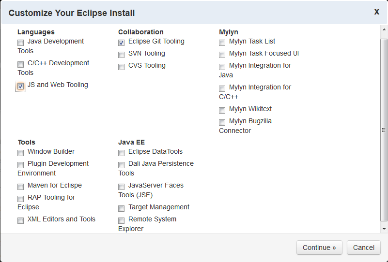

Node-Eclipse-Studio
===================

[Node on Eclipse Studio (NES)](https://github.com/Nodeclipse/Node-Eclipse-Studio)

<!-- NODE DONE -->

## Goal

The goal of the project is to created the lightest Eclipse Distribution for Node.js development.

Of course it will include Nodeclipse plugin. See [Nodeclipse team blog](https://github.com/Nodeclipse/nodeclipse-blog#blog)

It should not include Java Tools, but EGit, possibly JS & Web tools.

## Status 

*Under investigation*

I am trying to create our own Eclipse distribution using yoxos.

The start is simple ( just navigate to https://yoxos.eclipsesource.com/discover.html
and click "create your own custom install" )

However I have not succeeded with what to do next. The site is a bit mess. It is not clear if it is fully free.
 I will update, if I succeed.
 
### Second attempt - Googling
 
[Create your own Eclipse distro made easy](http://tomsondev.bestsolution.at/2012/07/13/create-your-own-eclipse-distro-made-easy/) 
 July 13, 2012 by Tom Schindl
 
https://github.com/tomsontom/distrobuilder cloned to https://github.com/Nodeclipse/distrobuilder

## Contacts

If you only need to install set of plugins, check [Eclipse Node IDE](https://github.com/Nodeclipse/eclipse-node-ide).

* How do I? -- StackOverflow!
* I got this error, why? -- StackOverflow!
* I got this error and I'm sure it's a bug -- file an issue!
* I have an idea/request -- file an issue!
* Why do you? -- the mailing list!
* When will you? -- the mailing list! 

Node on Eclipse Studio (NES) by [Paul Verest](mailto:paul.verest@live.com?subject=NES - Question
&body=I have pressed link in README.md)

If you want to contribute and actively work together, then [email](mailto:paul.verest@live.com?subject=NES - Development
&body=I want to contribute to Node on Eclipse Studio (NES))  
Skype pverest  
QQ 908781544  

## For Bloggers and Users of Twitter, Flickr, LinkedIn, Weibo etc.

In case you plan to blog or tweet about the Eclipse Node.js IDE, please use the tag "#Node-Eclipse-Studio"
 in order to make it easier to find all the comments and pictures. Thanks a lot for telling the world about the project!  
  | 请用#Node-Eclipse-Studio#标签微博一下。  
  | Por favor, utilizar etiqueta #Node-Eclipse-Studio  
  | ツイートする時は、＃Node-Eclipse-Studio タグを使用してください。   
  | Bitte benutzen Sie tag #Node-Eclipse-Studio um zu twiten.
 
